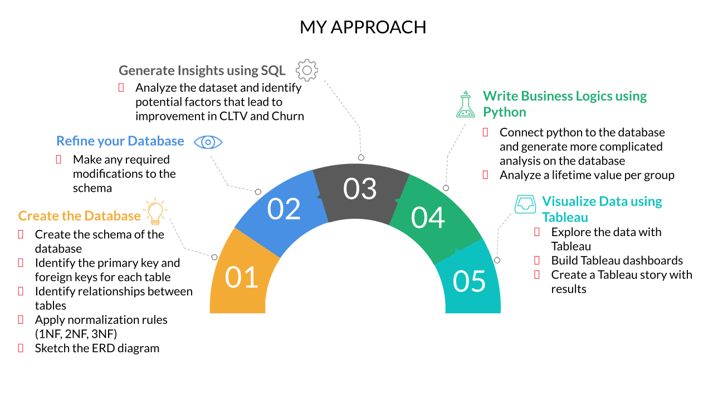
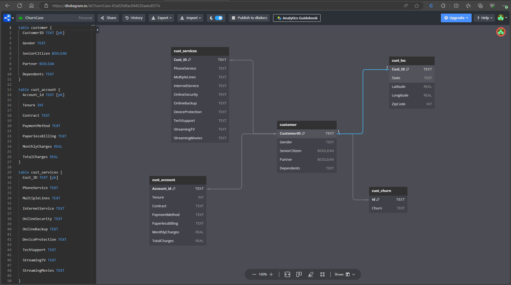
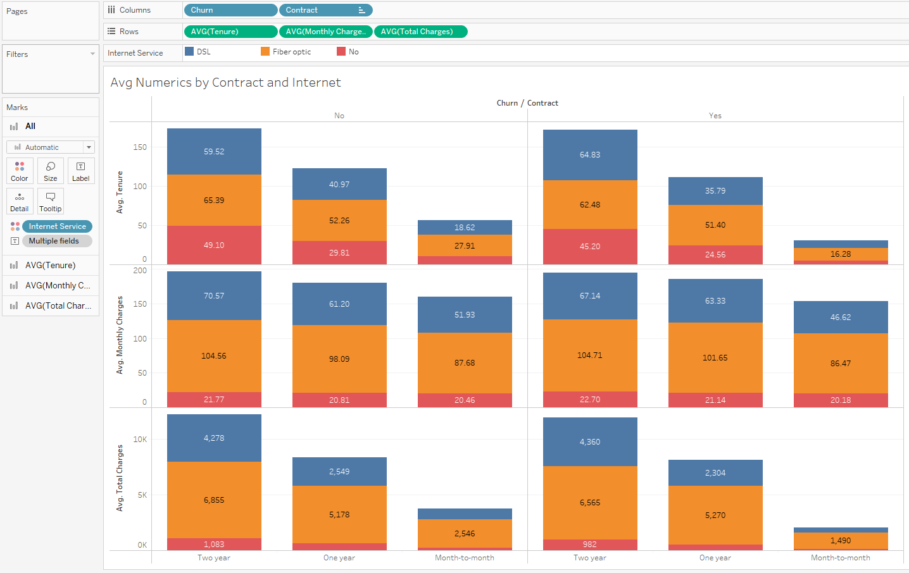
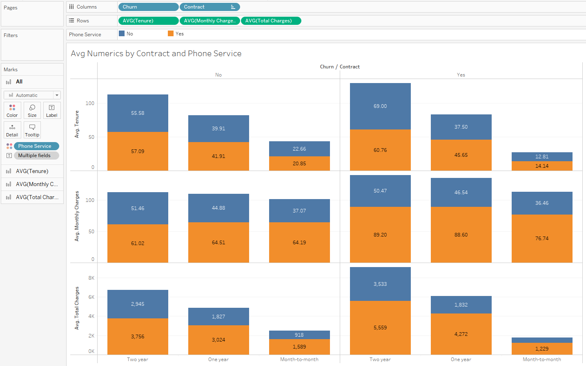
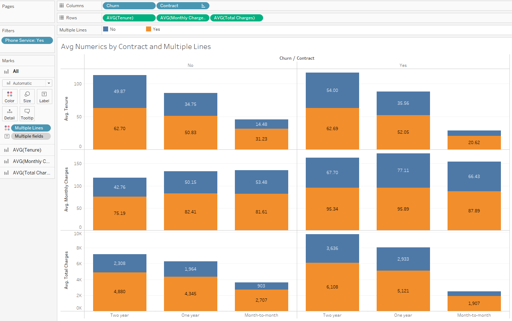
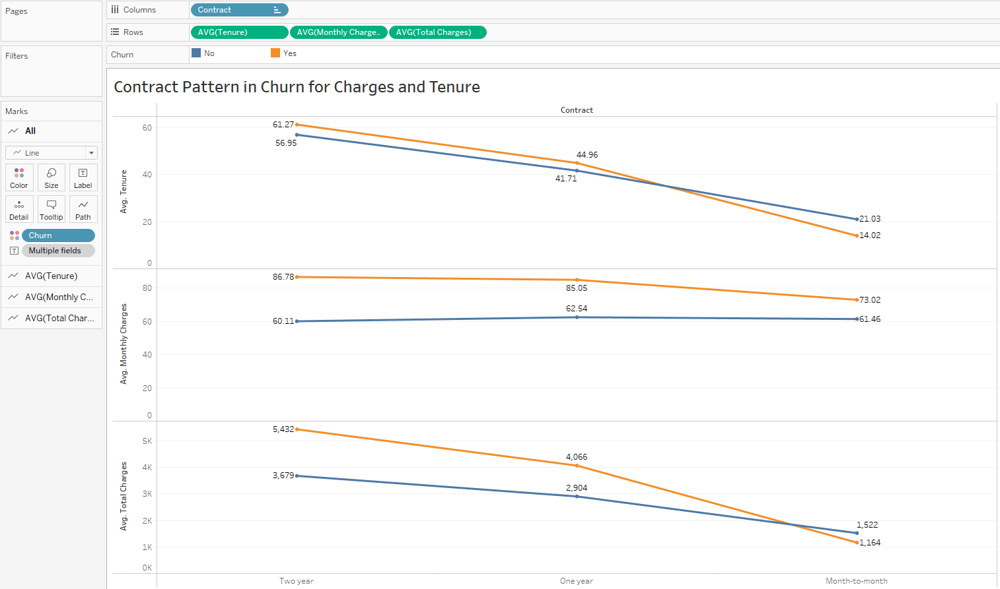
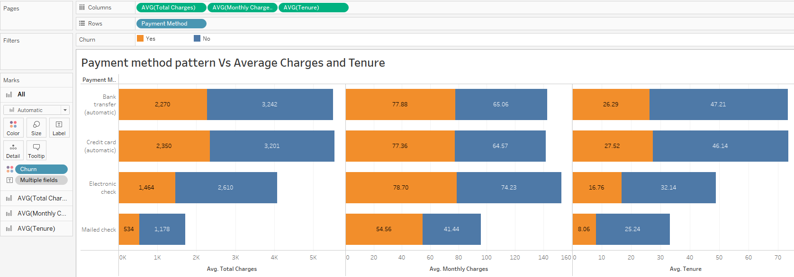

# Customer Churn

### Tools Used: Python, SQLite, Jupyter Notebook, Tableau

Interact with the final (data story) dashboard here: [Tableau Public dashboard](https://public.tableau.com/views/TelcoChurnandLTVAnalysis_17078507108480/Story1?:language=en-US&:display_count=n&:origin=viz_share_link)
(Interact in full screen for better view.)

_### Pending Work
  - Workflow details
  - DB structure
  - Code Documentation
  - Tableau Visualization_


### Problem Statement:

Play the role of an analyst working for a telecom company that provides home phone and internet services to 7,043 customers across Southern California. A new competitor has moved into the area, and the company you are working for is concerned about losing its existing customers. It wants to come up with a solution so that it does not have to worry about customers leaving.

Based on this case, the senior management of your company has defined the business objectives listed below, and it wants you to offer suggestions that can help achieve these objectives:
- Understand which services provided by the company are not performing well, so that the product team can improve the quality of such services and ensure the existing customers are happy with them
- Identify which variables are affecting the customers’ churn, based on existing data
- Identify the services that are being received well by the customers so that the company can use them to attract new customers
- Identify high-value customers so that the company can provide them with a premium membership to retain them for as long as possible



Why SQLite?
- One of the key reasons for using SQLite is that it comes readily installed with Python and is generally the go-to library when we want to run SQL queries directly on Python.
- SQLite is lightweight and small. Installing the SQLite browser on your system will take only a few kilobytes.
- Except from the data types, the code used to run in SQLite and MySQL is the same.
- You can integrate Python and Tableau directly using existing SQLite libraries on Python.

It is important to know how to use SQL on Python because:
- Python can work as a single interface for running simple queries and complicated calculations at the same time.
- You can create a single workflow to create databases, run queries, and use Python functions and libraries that are common to data analytics.
- Most big data libraries (e.g., Apache Spark) run SQL code through Python because it is the only way to parallelize and distribute code in a cluster.
- Most employees and companies require using SQL on Python because it is far easier to maintain and version SQL code when it is embedded in Python.

Some key highlights of codes in jupyter notebook:

1. A function named "table_info" was created, which can directly print the names of all the tables present in the database along with their respective columns. It's a reusable funtion that can be used in future projects in SQLite and Python.
(Refer Churn Case - Part 1.ipynb file to see it in action)

  ```python
      def table_info(conn,cursor):
      """
      prints out all the coulumns of every table in th DB
      
      conn: database connection object
      cursor: cursor object
      """
      tables = cur.execute("SELECT name FROM sqlite_master WHERE type='table';").fetchall()
      for table_name in tables:
          table_name = table_name[0]
          table = pd.read_sql_query("SELECT * from {} LIMIT 0".format(table_name), conn)
          print(table_name)
          for col in table.columns:
              print("\t "+ col)
              print()
```

2. Created an ERD (Entity Relationship Diagram) at [dbdiagram.io](https://dbdiagram.io/d)

  
   
3. Next, we had drawn insights by analyzing the data and answering some of the key questions in 'Churn Case - Part 2.ipynb' file:
     -  If we want to stop Churning we would like to sell contracts to people for at least one year, and much better for 2 years (Conjecture).
     -  We have 57% of the people that stayed in the company in the top 20% LTV with 2 year contracts, and only 11% of the people in the top 20% had a 2 year contract and left the company.
     -  95% of the people that left the company and are in the low 80% have a month-to-month contract, in contrast to only 50% of the people in the low 80% that stayed in the company.
     -  We can say that having a month-to-month contract is one of the reasons that people are leaving the company (conjecture).
  
4. Writing business logics in python (Refer Churn Case - Part 3.ipynb file)
   The logics written are as follows:
     -  The company wants to reward customers who have high lifetime values (LTVs) as these are the customers that we want to retain for as long as possible. In order to solve this logic, we will be sorting all the customers in decreasing order of LTV (implemented a bubble sort algorithm to sort the customers in decreasing order of their lifetime values.)
     -  Next, we want to create a column that can tag each customer as having a “high LTV” or a “low LTV.” (created another function to tag the customers into high- and low-LTV groups.)
     -  Added all the functions created in a single class, from where we can access all of them directly.

### Data Visualization & Storytelling using Tableau



Here are the conclusions drawn from this plot:
- People on 2-year contracts and in the fiber optic domain pay the highest total charges.
- At the same time, people in the fiber optic domain are also paying heavily as monthly charges; this could be a reason why there is more money in total charges.
----------------------------------------------------------------------------------------



Here are the conclusions drawn from this plot:
- We can see a difference between people who churned and did not churn. For example, people who churned and had the phone service were paying more money in total as compared with those who did not pay for the phone service.
- People who are paying more money on a monthly basis and using the phone service are more likely to leave the company.
----------------------------------------------------------------------------------------



Here are the conclusions drawn from this plot:
- Churn: Customers who had left the company were paying a lot of money for the phone service and multiple lines as compared with those who were still with the company.
- Contract: Customers who have a 2-year contract have much higher LTVs than those on a month-to-month contract.
- Lifetime value: People with a 1- or 2-year contract contribute more to the LTV. Hence, we should sell such contracts in order to get customers closer to higher LTVs. Nevertheless, this might risk people leaving the company, as we saw that they would be more likely to churn.
----------------------------------------------------------------------------------------



We can draw from this visualization that:
- The total charges are significantly higher for people who are on a 2-year contract than those who are on a month-to-month contract.
- People who stayed with the company had mostly subscribed to the 2-year contract as compared with people who had left.
- People who left the company were paying significantly higher monthly charges than those who did not leave. Therefore, although this might be good for an LTV, it may not be as good for the churn scenario of the company.
Thus, this plot shows the clear picture that people are likely to stay with the company for a much longer period and contribute more to it in terms of LTV if they have subscribed to a 2-year contract.
----------------------------------------------------------------------------------------



The conclusions that can be drawn from this visualization are as follows:
- Customers with the highest LTVs are the ones that are using bank and credit card transfers (automatic transfers) for making their payments.
- Customers who used automatic payment methods showed a tendency to be with the company longer as compared with those who used non-automatic payment methods.
- People are more likely to not churn if they use non-automatic payment methods, such as mailed cheques and electronic cheques; however, this does not contribute much to LTV.
----------------------------------------------------------------------------------------

Creating the Tableau Story - [Tableau Public dashboard](https://public.tableau.com/views/TelcoChurnandLTVAnalysis_17078507108480/Story1?:language=en-US&:display_count=n&:origin=viz_share_link)

- Average numerics by contract and internet
  - People leaving the company have paid more money in general when they have a 2-year contract.
  - People who have a month-to-month contract are most likely to churn.
  - People who have used phone services and multiple lines tend to pay more in general, but we saw that these customers tend to leave the company if they have to pay higher monthly charges.
- Streaming services analysis by churn and contract
  - Customers subscribed to streaming movies and streaming TV were contributing more to revenue (high LTVs).
  - Many customers subscribed to these services left the company as they had to pay higher monthly charges. So, customers are more likely to leave the company if we try to increase the LTV by increasing the monthly charges.
  - Hence, the company can decide to check the effect that increasing LTV has on churn and then take a decision.
- Contract pattern by charges and tenure
  - Having a 2-year contract is the best for having a high LTV and also for retaining the customers for as long as possible.
  - Customers with a month-to-month contract do not contribute much to LTV and are also more likely to churn.
- Payment method pattern by charges and tenure
  - We should encourage customers to make more automatic payments because such people generally have higher LTVs and stay with us longer.
- LTV by the most important services and by contract
  - We want to encourage customers to use 2-year contracts, internet services, phone services and multiple lines.
 

**END OF DOCUMENT**
